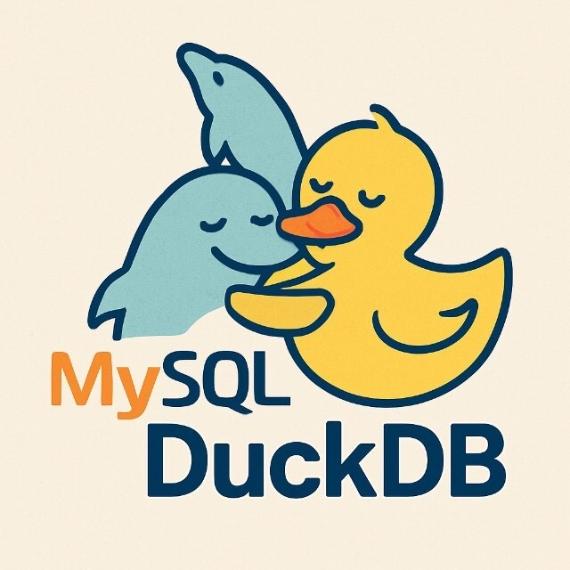

# AliSQL 中的 DuckDB

[ [DuckDB in AliSQL](./duckdb-en.md) | [AliSQL DuckDB 引擎](./duckdb-zh.md) ]

## 什么是 DuckDB？

[DuckDB](https://github.com/duckdb/duckdb) 是一个开源的嵌入式分析型数据库系统（OLAP），面向数据分析工作负载。凭借以下关键特性，DuckDB 正在数据科学、BI 工具以及嵌入式分析等场景中快速流行：

- **卓越的查询性能**：单机 DuckDB 的性能不仅远超 InnoDB，甚至可超过 ClickHouse 和 SelectDB
- **优秀的压缩能力**：DuckDB 采用列式存储，并会根据数据类型自动选择合适的压缩算法，压缩率非常高
- **嵌入式设计**：DuckDB 是嵌入式数据库系统，天然适合与 MySQL 集成
- **插件化架构**：DuckDB 采用插件式设计，便于第三方开发和功能扩展
- **友好的许可证**：DuckDB 的许可证允许任何形式的使用，包括商业用途

## 为什么在 AliSQL 中集成 DuckDB？

MySQL 长期缺少分析型查询引擎。InnoDB 天然面向 OLTP，在 TP 场景表现优秀，但在分析型工作负载下查询效率较低。本次集成带来：

- **混合负载**：在同一个数据库系统中同时运行 OLTP（MySQL/InnoDB）与 OLAP（DuckDB）查询
- **高性能分析**：相较 InnoDB，分析查询性能最高可提升 **200x**
- **降低存储成本**：由于高压缩率，DuckDB 只读从库通常仅需主实例 **20%** 的存储空间
- **100% MySQL 语法兼容**：无学习成本——DuckDB 以存储引擎方式集成，用户仍然使用 MySQL 语法
- **零额外管理成本**：DuckDB 实例的管理、运维和监控方式与普通 RDS MySQL 实例完全一致
- **一键部署**：可创建 DuckDB 只读实例，并支持将 InnoDB 数据自动转换为 DuckDB

**AliSQL** 将 **DuckDB** 作为原生 AP 引擎集成，在保持 MySQL 兼容与无缝体验的同时，为用户提供高性能、轻量级的分析能力。

## 架构

### MySQL 可插拔存储引擎架构
MySQL 的可插拔存储引擎架构允许其通过不同的存储引擎扩展能力：

该架构主要由四层组成：
- **运行时层（Runtime Layer）**：处理通信、访问控制、系统配置、监控等 MySQL 运行时任务
- **Binlog 层（Binlog Layer）**：负责 Binlog 生成、复制与应用
- **SQL 层（SQL Layer）**：负责 SQL 解析、优化与执行
- **存储引擎层（Storage Engine Layer）**：负责数据存储与访问

### DuckDB 只读实例架构

DuckDB 分析型只读实例采用读写分离架构：
- 分析类负载与主实例隔离，互不影响
- 通过 Binlog 机制从主实例复制数据（类似普通只读从库）
- InnoDB 仅存储元数据和系统信息（账号、配置等）
- 所有用户数据均存放在 DuckDB 引擎中

### 查询路径（Query Path）

1. 用户通过 MySQL 客户端连接
2. MySQL 解析查询并进行必要处理
3. 将 SQL 发送到 DuckDB 引擎执行
4. DuckDB 将结果返回给服务端层
5. 服务端层将结果转换为 MySQL 格式并返回给客户端

**兼容性**：
- 扩展 DuckDB 的语法解析器以支持 MySQL 特有语法
- 重写大量 DuckDB 函数并新增许多 MySQL 函数
- 自动化兼容性测试平台包含约 170,000 条 SQL 测试，显示 **[99% 兼容率](https://www.alibabacloud.com/help/en/rds/apsaradb-rds-for-mysql/compatibility-of-duckdb-based-analytical-instances?spm=a2c63.p38356.help-menu-26090.d_3_4_2.6a97448exEuaFG)**

### Binlog 复制路径（Replication Path）

AliSQL 允许 DuckDB 节点通过 Binlog 同步作为从库使用。通过重新设计事务提交与回放流程，AliSQL 弥补了 DuckDB 不支持 2PC 的不足，即使发生异常宕机也能确保数据与元数据的完全一致。

**幂等回放（Idempotent Replay）**：
- 由于 DuckDB 不支持两阶段提交（2PC），通过定制化的事务提交与 Binlog 回放流程，保证实例异常崩溃后数据一致性

**DML 回放优化（DML Replay Optimization）**：
- DuckDB 更偏好大事务；频繁的小事务会导致严重的复制延迟
- 实现批量回放机制，回放能力可达 **300K 行/秒**
- Sysbench 测试中可实现零复制延迟，甚至高于 InnoDB 的回放性能
- 批量写入优化同样适用于主库：借助 DML 优化，主库上的 INSERT 与 DELETE 也可能获得优秀性能

### DDL 兼容性与优化

- 原生支持的 DDL 使用 Inplace/Instant 执行
- 对于 DuckDB 原生不支持的 DDL（例如列重排），实现了 Copy DDL 机制
- InnoDB 转 DuckDB 支持多线程并行转换，执行时间降低 **7x**

## 性能基准测试（Performance Benchmarks）
**测试环境**：
- ECS 规格：32 CPU，128GB 内存，ESSD PL1 云盘 500GB
- Benchmark：TPC-H SF100

| Query ID | DuckDB | InnoDB | ClickHouse |
| --- | --- | --- | --- |
|q1|0.92|1134.25|3.47|
|q2|0.15|1800|1.52|
|q3|0.53|802.94|3.65|
|q4|0.46|1000.45|2.77|
|q5|0.5|1800|5.38|
|q6|0.22|566.73|0.73|
|q7|0.59|1800|6.06|
|q8|0.68|1800|6.99|
|q9|1.44|1800|13.29|
|q10|0.91|894.35|3.22|
|q11|0.11|79.63|1.1|
|q12|0.44|734.35|1.69|
|q13|1.59|454.15|5.85|
|q14|0.38|574.07|0.83|
|q15|0.31|568.43|1.53|
|q16|0.32|63.56|0.52|
|q17|0.89|1800|7.96|
|q18|1.59|1800|3.11|
|q19|0.8|1800|2.96|
|q20|0.51|1800|3.38|
|q21|1.64|1800|OOM|
|q22|0.33|361.4|4|
|total|15.31|25234.31|80.01|

DuckDB 在分析查询场景中展现出显著的性能优势，相比 InnoDB 最高可提升 **200x**。

## 在阿里云上体验
你可以在阿里云上体验集成 DuckDB 引擎的 RDS MySQL：

https://help.aliyun.com/zh/rds/apsaradb-rds-for-mysql/duckdb-based-analytical-instance/

## 相关链接（See also）

- [DuckDB 参数参考](./duckdb_variables-zh.md)
- [如何搭建 DuckDB 节点](./how-to-setup-duckdb-node-zh.md)
- [DuckDB GitHub 仓库](https://github.com/duckdb/duckdb)
- [详细文章（中文）](https://mp.weixin.qq.com/s/_YmlV3vPc9CksumXvXWBEw)
- [AliSQL](https://github.com/alibaba/AliSQL.git)