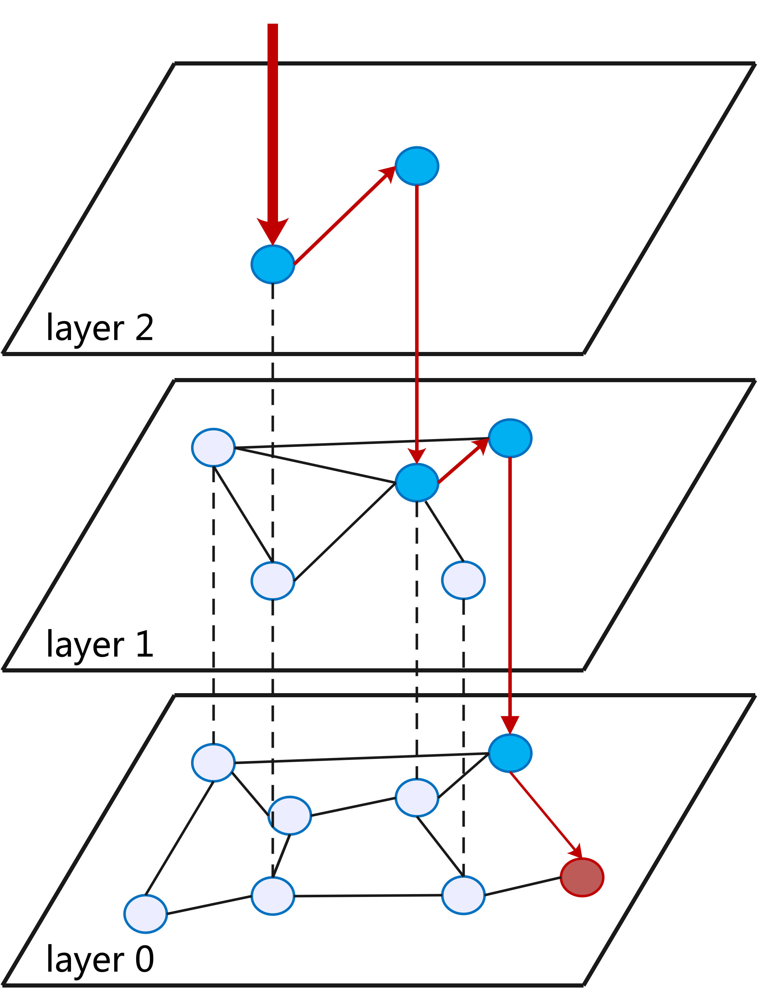

# AliSQL Vector Index (vidx) Feature Introduction

[ [AliSQL](../../README.md) | [Vector Index](./vidx_readme.md) | [向量索引](./vidx_readme_zh.md) ]

## Overview

AliSQL natively supports storage and computation of up to 16,383 dimensional vector data, integrates mainstream vector operation functions such as cosine similarity (COSINE) and Euclidean distance (EUCLIDEAN), and builds efficient nearest neighbor search capabilities based on deeply optimized HNSW (Hierarchical Navigable Small World) algorithm, supporting indexing of full-dimensional vector columns.

AliSQL's vector capabilities can provide out-of-the-box vectorized solutions for large-scale semantic retrieval, intelligent recommendation, multimodal analysis and other scenarios. Users can seamlessly achieve high-precision vector matching and complex business logic fusion computing through standard SQL interfaces.

### Core Features

<div style="text-align: center;">

</div>

- **High-Dimensional Support**: Supports up to 16,383 dimensional floating-point vector data storage
- **High Performance Retrieval**: Uses HNSW (Hierarchical Navigable Small World) graph algorithm to achieve high-performance similarity search
- **Multiple Distance Metrics**: Supports distance calculation methods such as EUCLIDEAN and COSINE
- **SIMD Hardware Acceleration**: Based on SIMD instruction set optimization to improve vector operation efficiency
- **Search Pruning Option**: Optimizes search process through techniques like Bloom filters
- **Configurable Parameters**: Supports adjusting index parameters to balance retrieval accuracy and performance
- **Hybrid Query**: Supports joint queries of vector data and scalar data

## Usage

### Vector Field Definition

Vector fields use a special [Field_vector](../../include/vidx/vidx_func.h#L43-L65) type definition, inheriting from [Field_varstring](../../include/field.h#L793-L798), using binary character set to store floating-point arrays.

```sql
CREATE TABLE table_name (
    id INT PRIMARY KEY,
    vector_col VECTOR(128)  -- 128-dimensional vector
);
```

### Creating Vector Index

Vector indexes can be created using the following syntax:

```sql
CREATE VECTOR INDEX vidx_name ON table_name (vector_col);  -- Using default parameters
```

Or specify directly in table definition:

```sql
CREATE TABLE table_name (
    id INT PRIMARY KEY,
    vector_col VECTOR(128),
    VECTOR INDEX vidx_name (vector_col) M=6 DISTANCE=COSINE  -- Specifying parameters
);
```

### Function Support

#### Vector Conversion Functions

| Function Name | Meaning |
|---------------|---------|
| VEC_FROMTEXT, TO_VECTOR, STRING_TO_VECTOR | String to vector |
| VEC_TOTEXT, FROM_VECTOR, VECTOR_TO_STRING | Vector to string |

#### Vector Calculation Functions

| Function Name | Meaning |
|---------------|---------|
| VECTOR_DIM | Vector dimension |
| VEC_DISTANCE, VEC_DISTANCE_EUCLIDEAN, VEC_DISTANCE_COSINE | Calculate distance between two vectors<br>If one of the arguments is a column in the vector index, distance type does not need to be specified, the vector index distance type will be automatically recognized |

Usage examples:

```sql
-- Sort using vector distance
SELECT * FROM table_name ORDER BY VEC_DISTANCE(vector_col, VEC_FROMTEXT("[1,2,3,4,5]")) LIMIT 10;

-- Display distance value in results
SELECT id, VEC_DISTANCE(vector_col, VEC_FROMTEXT("[1,2,3,4,5]")) AS distance 
FROM table_name ORDER BY distance LIMIT 10;
```

### Parameter Introduction

#### System Variables

| Variable Name | Description | Type | Default Value | Range |
|---------------|-------------|------|---------------|-------|
| vidx_disabled | Disable creation of vector columns and vector indexes | global | ON | ON, OFF |
| vidx_default_distance | Default vector distance type | session | EUCLIDEAN | EUCLIDEAN, COSINE |
| vidx_hnsw_default_m | HNSW algorithm default m | session | 6 | [3, 200] |
| vidx_hnsw_ef_search | HNSW algorithm default ef_search | session | 20 | [1, 10000] |
| vidx_hnsw_cache_size | HNSW algorithm default memory usage limit | global | 1024 * 1024 | [1048576,18446744073709551615] |

#### Index Parameters

- `M`: Controls the number of connections for each node in the graph, default value is 6, valid range is 3 to 200
- `DISTANCE`: Distance type for building index, default value is EUCLIDEAN

### Notes

1. Current version only supports RC (READ COMMITTED) transaction isolation level
2. Only supports creating vector indexes on InnoDB engine tables.
3. Creating, modifying, and deleting vector indexes cannot use inplace syntax.
4. Vector indexes cannot be set to INVISIBLE.
5. Vector fields cannot be NULL.
6. Creating and maintaining vector indexes consumes additional storage space and computational resources

### Error Handling

- `ER_NOT_SUPPORTED_YET`: Unsupported transaction isolation level
- `ER_WRONG_ARGUMENTS`: Function argument error
- `ER_VECTOR_INDEX_USAGE`: Vector index usage error
- `ER_VECTOR_INDEX_FAILED`: Vector index operation failure

## Technical Details

### Overall Architecture of Vector Search

As one of the most popular ANN algorithms, HNSW has gained widespread recognition and validation in institutional evaluations and engineering implementations. Currently, AliSQL prioritizes support for vector indexes based on the HNSW algorithm. The overall architecture of vector search is shown in the following diagram.

<div style="text-align: center;">

</div>

- ANN queries choose suitable indexes for searching after cost estimation, or can specify vector indexes for searching using hints such as FORCE INDEX.
- Logically, there is a complete HNSW graph. The information of this graph is organized as an auxiliary table and persistently stored on disk. Each row of data in this table represents a node in the HNSW graph. On this graph, the HNSW algorithm can be executed to achieve vector insertion and retrieval.
- Unlike ordinary indexes that directly access the storage engine, a vector index plugin is introduced. A node cache of the HNSW graph is maintained in memory to improve query efficiency.

### HNSW Algorithm

HNSW (Hierarchical Navigable Small World) is an efficient approximate nearest neighbor (ANN) search algorithm based on multi-layer graph structure. Its design can be summarized as:
- [Hierarchical Skip List] The 0th layer of the graph contains information of all points. From low to high, higher layers are abridged versions of lower layers containing only some points from lower layers. The top layer is used for quick jumps, and the bottom layer is used for precise searches.
- [Connecting Neighbors] Each layer is a proximity graph connected by vector distances, where each point records its closest few points as neighbors.

<div style="text-align: center;">

</div>

### Data Structure

AliSQL introduces a public cache (MHNSW Share) and transaction cache (MHNSW Trx) for vector data to accelerate vector query performance and ensure transaction safety for vector updates, achieving a balance between resource isolation and performance optimization. Public and transaction caches are accessed by different operations and have different design goals:
- [Public Cache] MHNSW Share is accessed by read-only transactions and mounted on the auxiliary table's TABLE_SHARE. Its core goal is to reduce the overhead of repeatedly loading vector nodes through shared caching, thereby improving query efficiency.
- [Transaction Cache] MHNSW Trx inherits from MHNSW Share and is used by read-write transactions. Each read-write transaction creates an independent MHNSW Trx instance, caching the nodes it accesses including those it modifies, avoiding contamination of the public cache, and only updating the public cache upon commit.

### Vector Computation Optimization

- [Precomputation Strategy] During the node cache loading phase, the system precomputes vector distances and caches the results, thus avoiding repeated calculations for frequently accessed nodes.
- [SIMD Instruction Set Acceleration] At the computation optimization level, modern CPU SIMD instruction sets (such as AVX512) are utilized to accelerate vector distance calculations. Through Bloom filters, the system can batch-process multiple vectors, converting scalar operations that originally required multiple executions into parallelized vector operations. This optimization significantly reduces CPU instruction cycle consumption.

## RDS MySQL Out-of-the-Box Vector Capabilities

Welcome to visit [Alibaba Cloud RDS MySQL Vector Capabilities](https://help.aliyun.com/zh/rds/apsaradb-rds-for-mysql/vector-storage-1), open-source ecosystem, ready to use out-of-the-box.